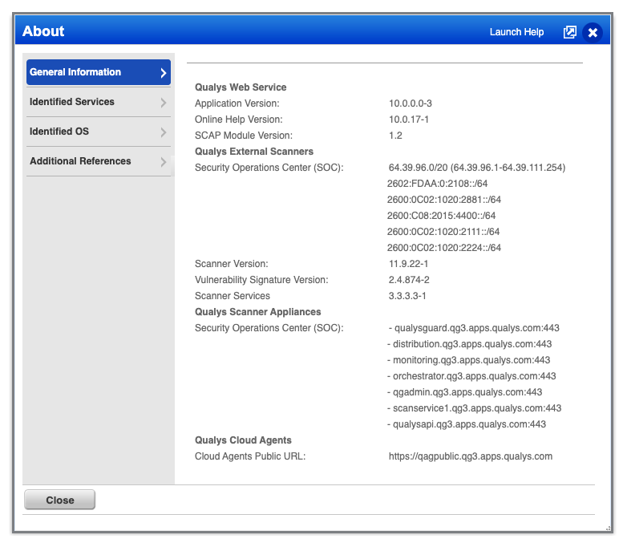

# Development

The Qualys integration uses various endpoints within the collection of Qualys
APIs to ingest data.

## Provider account setup

1. Request a [free trial of Qualys](https://www.qualys.com/free-trial/). You'll
   receive an email with your username and a link to access and reset your
   password.
2. Create a Web Application and a Vulnerabilty Scan of the application.
3. Send an email to your Account Manager (found in the username/password
   introduction email) requesting access to the API. Without this step, the API
   will respond with `404`.
4. Find your API URL from the **Help** -> **About** link in the web app.



## Configure your .env

By default, a Qualys trial does not allow access to knowledge base so a fake
Qualys knowledge base is provided as a tool in this integration.

Here's the recommended `.env` for this project (filling in your credentials):

```ini
QUALYS_USERNAME=
QUALYS_PASSWORD=
QUALYS_API_URL=https://qualysapi.qg3.apps.qualys.com

# Specify the port that will be used by fake Qualys Knowledge Base server
FAKE_QUALYS_KNOWLEDGE_BASE_SERVER_PORT=8080

# Use a fake Qualysis Knowldge Base API server during development.
#
# Start the server with following command:
#
# yarn start:fake-knowledge-base-server
#
QUALYS_KNOWLEDGE_BASE_API_URL=http://localhost:${FAKE_QUALYS_KNOWLEDGE_BASE_SERVER_PORT}

# If you want to log all request and responses then change RECORD_HTTP to true
RECORD_HTTP=false

JUPITERONE_API_KEY=
```

## Running integration

First, start fake Qualys Knowledge Base server if your license does not allow
knowledge base requests.

```sh
yarn start:fake-knowledge-base-server
```

Next, run the integration:

```sh
yarn start
```

## Authentication

All requests to the API use Basic Auth mechanism for sending username and
password. There is a _login_ API route that will send back a session ID but it
didn't seem neessary to use this endpoint and you would have to ensure that you
call _logout_ (otherwise you might hit maximum number of concurrent sessions
limit).

The Qualys API is a collection of APIs from different modules and the various
APIs follow different patterns.

The `QualysClient` class currently has the following methods:

- `qualysClient.assetManagement.listHostAssets(options)`
- `qualysClient.knowledgeBase.listQualysVulnerabilities(options)`
- `qualysClient.vulnerabilityManagement.listHostDetections(options)`
- `qualysClient.webApplicationScanning.listScans(options)`
- `qualysClient.webApplicationScanning.listWebApps(options)`
- `qualysClient.webApplicationScanning.fetchWebApp(options)`
- `qualysClient.webApplicationScanning.fetchScanResults(options)`

The _list_ functions return a _paginator_ that can be used similar to the
following:

```typescript
const paginator = qualysClient.assetManagement.listHostAssets(options);
do {
  const { responseData } = await paginator.next();
} while (paginator.hasNextPage());
```
